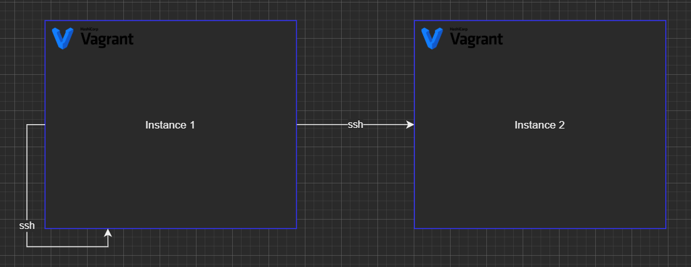
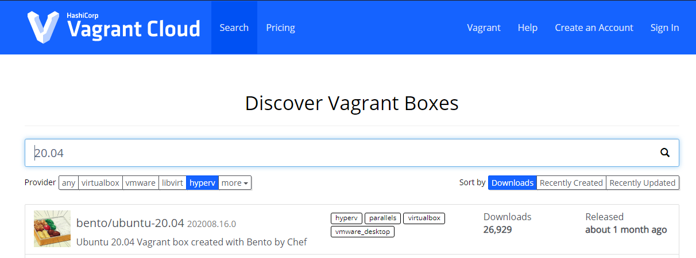
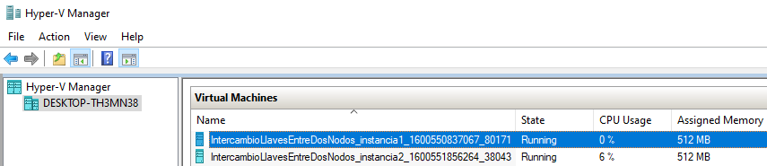
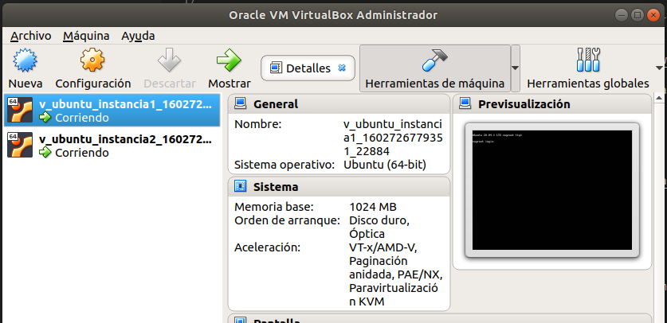
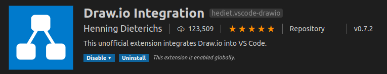

# IntercambioLlavesEntreDosNodos

Este repositorio describe el proceso de intercambio de llaves entre dos nodos (usando Vagrant) y entre la misma máquina de manera circular. Como se describe en el siguiente diagrama.

Que necesitamos para el ejemplo:

1) Vagrant Instalado
1) Hyper-V corriendo y habilitado en Windows10
1) Un switch creado en Hyper-V para ser usado en las instancias (windows10).
1) Si estas en linux virtualbox

**Nota**: Puedes encontar infromación de como crear los switch en: [Minikube con Hyper-V en Windows10](https://medium.com/@alejandroleon09/minikube-con-hyper-v-en-windows10-2f3fae956c3b)



## Instancia de Dos Nodos con [Vagrant](https://www.vagrantup.com/)

Acorde con el diagrama de trabajo necesitamos crear dos instacias lo cual se hace el archivo [Vagrantfile para windows10](v_windows/Vagrantfile) ó en el archivo [Vagrantfile para Ubuntu](v_ubuntu/Vagrantfile) 

El proyecto hace uso de la configuración [multimáquina](https://www.vagrantup.com/docs/multi-machine)

Para levantar las dos máquinas virtuales necesitas enjecutar en una linea de comandos de administrador lo siguiente:

```shell
vagrant up
```

La descarga inicial de la imagen [**bento/ubuntu-20.04**](https://app.vagrantup.com/boxes/search?provider=hyperv&q=20.04&sort=downloads&utf8=%E2%9C%93) tomará algún tiempo antes de iniciar los nodos virtuales. Más información de esta imagen la puedes encontrar en la nuve de vagrant al filtrar por 20.04 y hyperv.



### Verificación de Nodos corriendo

Se puede verificar que los nodos ya estan corriendo al revisar el manger del hypervisor en windows10.



O al revisar el manager de virtualbox.



## Generando las llaves en diferentes nodos

Lo primero es incresar a cada uno de los nodos por ssh con el comando de vagrant y ejectuar lo siguiente:

```ssh
ssh-keygen -q -t rsa -N '' -f ~/.ssh/id_rsa <<<y 2>&1 >/dev/null
```

Lo anterior creará una carpeta ~/.ssh en el folder del usuario vagrant y generaŕa una llave de tipo RSA
en su parte publica y privada. Una explicación mas detallada puede encontarse [aquí](https://stackoverflow.com/questions/43235179/how-to-execute-ssh-keygen-without-prompt/45031320)

Para ingresar a cada nodo a ejecutar el comando haga lo siguiente:

```shell
vagrant ssh instancia1
```

Esto genera los siguientes archivos de idetificación

```shell
.ssh/
├── authorized_keys
├── id_rsa
└── id_rsa.pub
```


## Plugins usados en VSCode

Estos plugins se pueden instalar presionando crtl+shift+p y pegando el comando **ext install** respectivo.

[](https://marketplace.visualstudio.com/items?itemName=hediet.vscode-drawio)

ext install hediet.vscode-drawio
